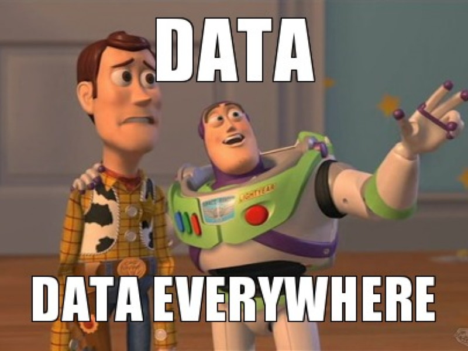

## Data@CREST

**Data & computation - on of the CREST's strength !**

{fig-align="center"}

## The Data Hub: who to ask, for what

**Dedicated support** — office 4044 - [emilien.schultz@ensae.fr](emilien.schultz@ensae.fr)

- Émilien Schultz: computational social science, text as data, scientific programming, software development, infrastructure strategy, AI, ...
- Alban Derepas (since september): econometrics, image, machine learning

(IT & infrastructure (DSIT) — Philippe Pinczon du Sel, office 4036)

**We are in a rich ecosystem of resources: don't hesitate to discuss your computational practices with us.**

## Digital Skills for PhDs — 12 November afternoon

A half-day training on the essential toolbox for research computing:

- *"Don't be afraid of the command line"*: **Unix basics**
- *"Learning from open-source practices"*: **Git & GitHub** for versioning and collaboration
- *"Separate content from form"*: **LaTeX** for articles and theses + **Quarto** for reproducible documents and slides

[More information to come — registration link soon]{.comment} <!-- TODO: link -->

## More to come this year about AI

**Generative AI in research** - a lot of changes

Many personal initiatives already exist, so we will discuss during the year (reach out if you want to discuss them)

A small interdisciplinary group of early users:

- Nicolas Brosse (statistics)
- Jonathan Garson (economics)
- ...

[Again, more information to come]{.comment}
